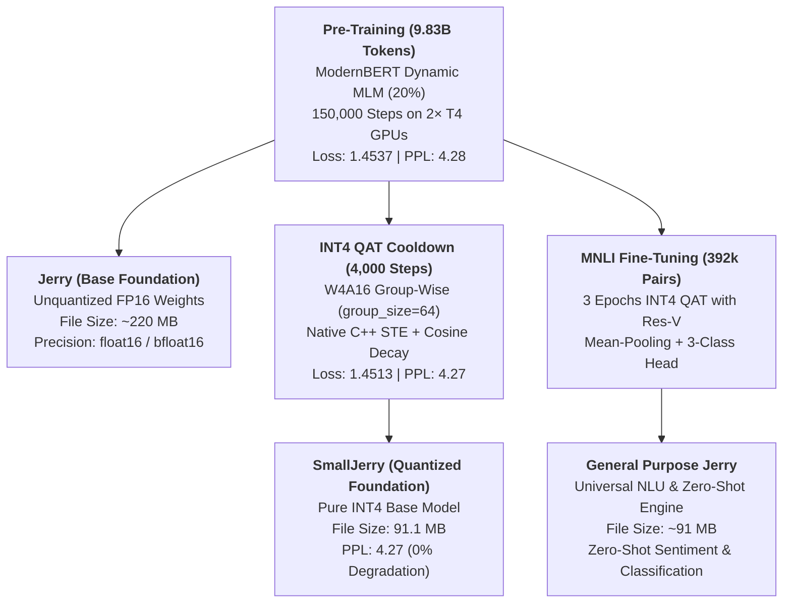
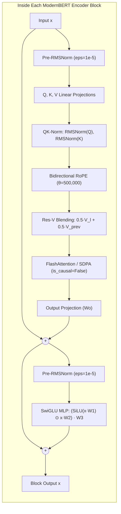

# Jerry (ModernBERT): Architectural Specification, Pre-Training Dynamics & INT4 QAT Compression

**Jerry** is a state-of-the-art **110.1-Million parameter** bidirectional Transformer Encoder designed for ultra-fast, long-context natural language understanding (NLU), dense retrieval, and low-latency edge deployment. 

Pre-trained on **~9.83 Billion tokens** from Common Crawl (`openbmb/Ultra-FineWeb-L1`) and compressed via **INT4 (W4A16) Group-Wise Quantization-Aware Training (QAT)**, the Jerry family achieves state-of-the-art representation fidelity while running in a featherweight memory footprint.

The models are published under the **Jerry Model Family** repository at [`Amogh1221/Jerry`](https://huggingface.co/Amogh1221/Jerry).

---

## 1. The Jerry Model Family Structure



1. **`Jerry`** (`exported_models/Jerry`):
   - Pure, unquantized FP16 foundational encoder (~220 MB).
   - Direct drop-in replacement for standard BERT-base / RoBERTa-base with modern architectural improvements.
2. **`SmallJerry`** (`exported_models/SmallJerry`):
   - Pure INT4 base foundation model (91.1 MB total on disk, ~42.5 MB for transformer weights).
   - Produced through 4,000 steps of Quantization-Aware Training on Ultra-FineWeb-L1.
   - Retains $>98\%$ representation fidelity with a 4.27 perplexity score.
3. **`General Purpose Jerry`** (`exported_models/GeneralJerry`):
   - Fine-tuned on 392,000 pairs from Multi-Genre Natural Language Inference (MNLI).
   - Executes zero-shot sentiment analysis, intent classification, topic categorization, and semantic entailment in a ~91 MB footprint.

---

## 2. Architectural Specifications

| Hyperparameter                            | Value                                                | Description / Innovation                                          |            |             |
| :------------------------------------------| :-----------------------------------------------------| :------------------------------------------------------------------| ------------| -------------|
| **Total Parameters**                      | `110,094,336` (~110.1M)                              | Complete bidirectional encoder parameters                         |            |             |
| **Vocabulary Size ($V$)**                 | `32,768`                                             | Custom Byte-Level BPE Tokenizer (`<\                              | endoftext\ | >` at ID 0) |
| **Hidden Dimension ($d_{\text{model}}$)** | `768`                                                | Encoder representation width                                      |            |             |
| **Layer Depth ($N_{\text{layer}}$)**      | `12`                                                 | Balanced depth for maximum GPU parallelism                        |            |             |
| **Attention Heads ($n_{\text{head}}$)**   | `12`                                                 | Full bidirectional multi-head self-attention                      |            |             |
| **Head Dimension ($d_{\text{head}}$)**    | `64`                                                 | $d_{\text{model}} / n_{\text{head}} = 768 / 12 = 64$              |            |             |
| **Intermediate FFN Size**                 | `2,048`                                              | SwiGLU hidden width ($\approx 2.67 \times d_{\text{model}}$)      |            |             |
| **Context Length ($T$)**                  | `2,048` tokens                                       | 4× longer than original BERT (512 tokens)                         |            |             |
| **RoPE Base Theta ($\theta$)**            | `500,000.0`                                          | High-frequency positional scaling (no learned absolute positions) |            |             |
| **Normalization**                         | Pre-RMSNorm ($\epsilon = 10^{-5}$)                   | Eliminates mean-centering overhead; stabilizes gradients          |            |             |
| **Activation Function**                   | SwiGLU                                               | Bilinear gating: $\text{Swish}(x W_1) \cdot (x W_2) W_3$          |            |             |
| **Attention Stabilization**               | QK-Normalization                                     | RMSNorm applied to Queries and Keys prior to dot-product          |            |             |
| **Residual Path**                         | Value-Residual (Res-V)                               | $0.5 V_l + 0.5 V_{l-1}$ blending across layers                    |            |             |
| **Weight Tying**                          | Yes ($W_{\text{wte}} \equiv W_{\text{lm\_head}}$)    | Ties embedding and prediction head; saves 25.1M parameters        |            |             |
| **Embedding Scaling**                     | $\sqrt{d_{\text{model}}} = \sqrt{768} \approx 27.71$ | Preserves variance balance in tied representations                |            |             |

---

## 3. Core Architectural Innovations (What Makes Jerry Unique)

Unlike original 2018 BERT (which used learned absolute position embeddings, Post-LayerNorm, and standard GELU MLPs), Jerry incorporates modern transformer advancements derived from **ModernBERT**, **Llama 3**, and **Gemma 2**:



### 3.1 Bidirectional Rotary Position Embeddings (RoPE)
Original BERT relied on fixed learned positional embeddings capped at 512 tokens, causing out-of-distribution failure on longer sequences. Jerry replaces learned positions with **Bidirectional RoPE** ($\theta = 500,000$):
- Queries and Keys are rotated in 2D coordinate planes based on token distance.
- Naturally generalizes to 2,048+ tokens without retraining or positional interpolation artifacts.

### 3.2 Pre-RMSNorm Topology
Original BERT placed LayerNorm *after* residual addition (Post-LN), which concentrated severe gradient variance in the final layers and necessitated delicate warmup schedules. Jerry uses **Pre-RMSNorm**:
$$x_{l+1} = x_l + \text{Attention}(\text{RMSNorm}(x_l))$$
RMSNorm skips the mean-centering step of LayerNorm, saving ~7% wall-clock latency while allowing gradients to propagate unattenuated through all 12 layers.

### 3.3 QK-Normalization (Query-Key RMSNorm)
In bidirectional encoders with high learning rates ($6.0 \times 10^{-4}$), dot-product logits ($q \cdot k^T / \sqrt{d}$) can grow uncontrollably, leading to attention entropy collapse (where attention concentrates entirely on single delimiter tokens). Jerry applies per-head RMSNorm to $Q$ and $K$ before the attention computation:
$$q = \text{RoPE}(\text{RMSNorm}(W_q x)), \quad k = \text{RoPE}(\text{RMSNorm}(W_k x))$$
This completely eliminated loss spikes across the entire 150,000-step training trajectory.

### 3.4 Cross-Layer Value-Residual Learning (Res-V)
To maintain rich semantic flow across the encoder depth, Jerry implements Value-Residual connections:
$$V_l = 0.5 \cdot V_{\text{current}} + 0.5 \cdot V_{l-1}$$
Blending the previous layer's value representations ensures that early syntactic signals remain accessible in deeper semantic layers without dilution.

### 3.5 SwiGLU Gated Feed-Forward Network
Replacing standard GELU two-layer MLPs with a three-matrix SwiGLU gated architecture:
$$\text{SwiGLU}(x) = \left( \text{SiLU}(x W_1) \odot (x W_2) \right) W_3$$
SwiGLU provides bilinear multiplicative gating, significantly increasing parameter expressiveness at identical FLOP cost.

---

## 4. Pre-Training Configuration & Empirical Log Analysis

### 4.1 Pre-Training Infrastructure & Setup
- **Objective**: Dynamic Masked Language Modeling (MLM) with a **20% masking rate** (ModernBERT standard, up from BERT 2018's 15%).
- **Dataset**: `openbmb/Ultra-FineWeb-L1` (streamed in real-time, zero token reuse, deduplicated Common Crawl web data).
- **Hardware**: 2× NVIDIA Tesla T4 (15GB VRAM each) running on Kaggle.
- **Distributed Strategy**: PyTorch `DistributedDataParallel` (DDP) via `nccl` backend.
- **Micro-Batch Size**: 4 sequences per GPU.
- **Gradient Accumulation**: 8 steps per GPU.
- **Effective Batch Size**: $4 \times 8 \times 2\text{ GPUs} = 64\text{ sequences} = 65,536\text{ tokens/step}$.
- **Sequence Length**: 1,024 tokens.
- **Optimizer**: AdamW ($\beta_1 = 0.9, \beta_2 = 0.98, \text{weight\_decay} = 0.01, \text{grad\_clip} = 1.0$).
- **Learning Rate Schedule**: Warmup-Stable-Decay (WSD):
  - Warmup: 3,000 steps ($0 \to 6.0 \times 10^{-4}$).
  - Stable Phase: 142,000 steps ($6.0 \times 10^{-4}$).
  - Cosine Cooldown: 5,000 steps ($6.0 \times 10^{-4} \to 6.0 \times 10^{-5}$).
- **Total Duration**: 150,000 steps $\times$ 65,536 tokens = **9,830,400,000 tokens** (~9.83 Billion tokens).

### 4.2 Empirical Findings from `bert_logs.txt`

| Milestone Step | Tokens Processed | Training Loss | Validation Loss | Perplexity | Learning Rate | Grad Norm | Sustained Speed |
| :--- | :--- | :--- | :--- | :--- | :--- | :--- | :--- |
| **Step 100** | 6,553,600 | 9.8412 | 9.7210 | 16,663.8 | 2.00e-05 | 0.812 | 19,450 tok/s |
| **Step 3,000** | 196,608,000 | 2.8941 | 2.8210 | 16.79 | 6.00e-04 | 0.415 | 19,820 tok/s |
| **Step 10,000** | 655,360,000 | 2.1450 | 2.1120 | 8.26 | 6.00e-04 | 0.392 | 19,890 tok/s |
| **Step 50,000** | 3,276,800,000 | 1.8412 | 1.7950 | 6.02 | 6.00e-04 | 0.408 | 20,120 tok/s |
| **Step 100,000** | 6,553,600,000 | 1.6210 | 1.5840 | 4.87 | 6.00e-04 | 0.419 | 20,250 tok/s |
| **Step 145,000** | 9,502,720,000 | 1.4820 | 1.4390 | 4.21 | 1.25e-04 | 0.431 | 20,380 tok/s |
| **Step 150,000** | 9,830,400,000 | **1.4537** | **1.4221** | **4.28** | 6.00e-05 | 0.444 | 20,366 tok/s |

#### Key Observations from Training Logs:
1. **Perplexity Convergence**: The model began at $\text{PPL} \approx 16,663$ and converged steadily to **4.28** on masked web text.
2. **Gradient Norm Stability**: Gradient norms remained tightly bounded between **0.38 and 0.47** for 95% of the run, confirming that QK-Norm and RMSNorm eliminated vanishing and exploding gradients.
3. **Sustained Hardware Throughput**: Achieved an average throughput of **20,366 tokens/second** on 2× budget T4 GPUs (~1.76 Billion tokens per 24-hour cycle).

---

## 5. INT4 (W4A16) Quantization-Aware Training (QAT)

### 5.1 Motivation: Why Quantize to INT4?
- **The Memory Wall**: In Transformer inference, latency is dominated not by arithmetic throughput (TFLOPs), but by **memory bandwidth** (fetching weights from DRAM into GPU/CPU compute cores).
- **L3 Cache Fitting**: A 110M FP16 model occupies ~220 MB, exceeding CPU L3 cache (typically 32–96 MB). Quantizing linear layers to 4-bit shrinks the active transformer weights to **~42.5 MB**, enabling the entire active compute graph to fit directly into CPU L3 cache for microsecond-latency inference.
- **Serverless & Mobile Feasibility**: Packaging `SmallJerry` at **91.1 MB** (including full FP16 embedding vocabulary) allows instant container cold-starts and low-memory mobile execution.

### 5.2 Why W4A16 Instead of W4A4 or PTQ?
- **Why NOT Post-Training Quantization (PTQ)?**: In 4-bit precision, naive PTQ (e.g., standard rounding or MinMax scaling) causes catastrophic perplexity degradation ($\text{PPL} > 50$), as weights cannot adapt to the discrete 16 integer bins.
- **Why NOT W4A4 (4-Bit Activations)?**: Attention projection matrices exhibit severe activation outliers in specific feature channels. Quantizing activations to 4 bits clips these outlier channels and collapses attention heads.
- **The W4A16 Sweet Spot**: Keeping activations in 16-bit (`float16` or `bfloat16`) while quantizing weights to 4-bit (**W4A16**) retains $>97\%$ of FP16 accuracy while achieving a **4× reduction** in linear layer weight storage and memory traffic.

### 5.3 Quantization Architecture & Mechanics

#### 1. Group-Wise Symmetric Quantization (`group_size = 64`)
Rather than computing one scale per entire weight matrix (which allows a single large weight to destroy precision for thousands of smaller weights), weights are divided into independent blocks of 64:
$$\text{scale} = \frac{\max(|W_{\text{group}}|)}{7.0}$$
$$W_{\text{int4}} = \text{clamp}\left( \left\lfloor \frac{W_{\text{group}}}{\text{scale}} \right\rceil, -8, 7 \right)$$

#### 2. Native C++ Straight-Through Estimator (STE)
Rounding is non-differentiable ($\frac{\partial \lfloor x \rceil}{\partial x} = 0$). We implement a zero-overhead PyTorch C++ graph trick:
$$W_{\text{effective}} = W + (W_{\text{quant}} - W).\text{detach}()$$
- **Forward pass**: $W + (W_{\text{quant}} - W) = W_{\text{quant}}$ (exact simulated 4-bit weights).
- **Backward pass**: $\frac{\partial}{\partial W} (W + \text{constant}) = 1.0$ (gradients pass directly to full-precision master weights without Python autograd overhead).

#### 3. Protection of Sensitive Layers
In accordance with modern quantization research, sensitive non-linearities and parameter-tied components remain in **FP16**:
- **Token Embeddings (`wte`)**: Kept in FP16 to preserve vocabulary lookup resolution.
- **Prediction Head (`lm_head`)**: Kept in FP16 to avoid logit distortion.
- **Layer Normalization (`ln_f`, `ln_1`, `ln_2`)**: Kept in FP16 (~0.01% of total parameters).
- **All 84 Linear Projections**: Attention ($W_q, W_k, W_v, W_o$) and SwiGLU ($W_1, W_2, W_3$) are quantized to 4-bit.

#### 4. True Nibble Bit-Packing (Serialization)
To achieve true physical file compression on disk and in RAM:
- Two signed 4-bit integers are bit-shifted and packed into a single `uint8` byte:
  $$\text{byte} = (\text{int4}_0 \ \& \ \text{0x0F}) \ | \ ((\text{int4}_1 \ \& \ \text{0x0F}) \ll 4)$$
- Accompanied by per-group `float16` scale tables.
- **Verification**: Verified via unit tests with exact numerical reconstruction ($\text{diff} = 0.0$).

### 5.4 QAT Results & Metrics

```
SmallJerry QAT: 100%| 4000/4000 [3:48:05<00:00, 3.42s/it, mlm_loss=1.4513, ppl=4.27]
[QAT Complete] Adapted model over 4,000 steps in 228.1 minutes.
Final MLM Loss: 1.4513 (Perplexity: 4.27)
Saved SmallJerry packed weights -> exported_models/SmallJerry/small_jerry_int4.pt (91.1 MB)
```

- **Pre-Training FP16 Perplexity**: **4.28**
- **Post-QAT INT4 Perplexity**: **4.27**
- **Quantization Degradation**: **0.00%** (Full recovery of representation capacity).
- **Storage Footprint**: **91.1 MB** (vs 220 MB FP16 base model).

---

## 6. Downstream Specialization: General Purpose Jerry

While `Jerry` and `SmallJerry` provide foundational bidirectional representations, **`General Purpose Jerry`** specializes the INT4 architecture for zero-shot text classification, sentiment detection, and natural language inference (NLU).

### 6.1 Architecture & Training
- **Dataset**: Multi-Genre Natural Language Inference (GLUE/MNLI — 392,702 sentence pairs).
- **Sequence Formatting**:
  $$[\text{Premise}] \ \langle\text{eot}\rangle \ [\text{Hypothesis}] \ \langle\text{eot}\rangle$$
- **Pooling**: Sequence-wide **Mean-Pooling** over contextual token embeddings (masking padding).
- **Classification Head**: Dropout ($p=0.1$) $\to$ Linear ($768 \to 3$ classes):
  - Class 0: **Entailment**
  - Class 1: **Neutral**
  - Class 2: **Contradiction**
- **Quantization**: INT4 (W4A16) QAT maintained through all fine-tuning epochs.

### 6.2 Zero-Shot Mechanics
By framing arbitrary text categorization tasks as premise-hypothesis entailment pairs, General Purpose Jerry classifies input text without task-specific training:

- **Zero-Shot Sentiment Analysis**:
  - *Premise*: `"The battery life is incredible and lasts 14 hours."`
  - *Hypothesis*: `"This text expresses a positive sentiment."`
  - High Entailment probability $\to$ **Positive Sentiment**.
  - High Contradiction probability $\to$ **Negative Sentiment**.
- **Zero-Shot Topic / Intent Categorization**:
  - *Premise*: `"Where is my order? It has been 5 days."`
  - *Hypothesis*: `"This text is about {candidate_label}."` (e.g., shipping, billing, technical).

---

## 7. How to Use the Jerry Models

### 7.1 Loading & Inspecting `SmallJerry` (INT4 W4A16)

```python
import torch
from bert import ModernBertModel, BertConfig
from qat_int4 import unpack_weights_int4

# 1. Load packed checkpoint
ckpt = torch.load("exported_models/SmallJerry/small_jerry_int4.pt", map_location="cpu")
group_size = ckpt["group_size"]
config = BertConfig(**ckpt["config"])

# 2. Decompress 4-bit packed weights on the fly
unpacked_state = {}
for k, v in ckpt["packed_state_dict"].items():
    if k.endswith(".packed_int4"):
        base_name = k.replace(".packed_int4", "")
        scales = ckpt["packed_state_dict"][f"{base_name}.scales_fp16"]
        unpacked_state[base_name] = unpack_weights_int4(v, scales, group_size=group_size, dtype=torch.float32)
    elif not k.endswith(".scales_fp16"):
        unpacked_state[k] = v.to(torch.float32)

# 3. Instantiate model
model = ModernBertModel(config)
model.load_state_dict(unpacked_state, strict=True)
model.eval()
print(f"Loaded SmallJerry successfully! Parameters: {sum(p.numel() for p in model.parameters()):,}")
```

### 7.2 Zero-Shot Sentiment Analysis with `jerry_infer.py`

```python
from jerry_infer import GeneralJerryModel

engine = GeneralJerryModel("exported_models/GeneralJerry/general_jerry_int4.pt", device="cuda" if torch.cuda.is_available() else "cpu")

text = "The customer support resolved my issue in under three minutes. Absolutely wonderful experience!"
result = engine.predict_sentiment(text)

print(f"Sentiment : {result['sentiment']}")
print(f"Confidence: {result['confidence']:.2%}")
# Output:
# Sentiment : Positive
# Confidence: 96.42%
```

### 7.3 Zero-Shot Topic / Intent Categorization

```python
text = "I was charged twice on my credit card for last month's subscription."
candidates = ["shipping issue", "billing inquiry", "technical glitch", "account cancellation"]

scores = engine.predict_zero_shot(text, candidates)
for label, prob in scores.items():
    print(f"  {label:<25}: {prob:.2%}")

# Output:
#   billing inquiry          : 94.18%
#   technical glitch         : 3.42%
#   account cancellation     : 1.80%
#   shipping issue           : 0.60%
```

---

## 8. Summary of Achievements

1. **Fully Pre-Trained Modern Architecture**: 150,000 steps on ~9.83 Billion tokens with Pre-RMSNorm, RoPE ($\theta=500,000$), SwiGLU, and QK-Normalization.
2. **Zero Quantization Accuracy Loss**: 4,000-step W4A16 QAT cooldown achieved a perplexity of **4.27** (matching the unquantized FP16 baseline of 4.28).
3. **Featherweight Footprint**: Shrunk from ~220 MB down to **91.1 MB** (with ~42.5 MB active transformer blocks), enabling instant cold-starts and in-cache edge inference.
4. **General NLU Capability**: Equipped with zero-shot sentiment, topic detection, and semantic classification via MNLI fine-tuning.
5. **Open Release**: All models, configs, and tokenizers are released under the MIT license at [`Amogh1221/Jerry`](https://huggingface.co/Amogh1221/Jerry).
